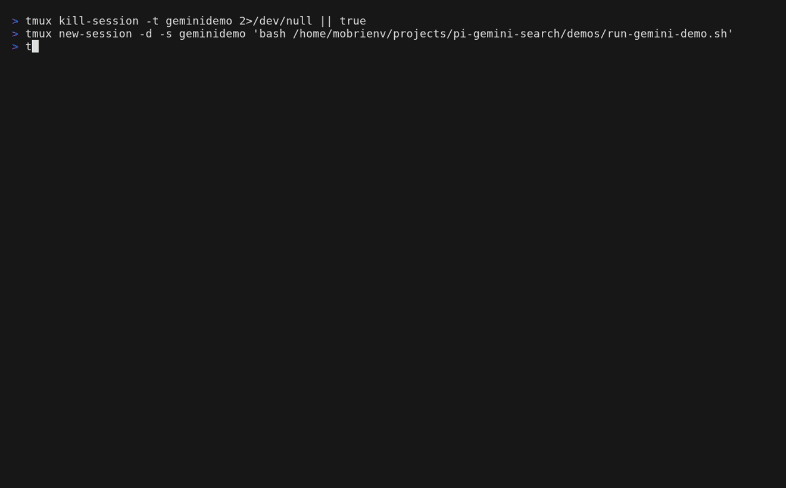

# pi-gemini-search

Pi extension package that exposes Gemini CLI web research as a native Pi tool.

## What it adds

- **Tool:** `gemini_search`
- **Command:** `/gemini-search <question>`
- **Live progress updates:** elapsed time + search counters while Gemini runs
- **Prompt visibility:** returned details include the exact rendered search prompt

## Demo



## Behavior

The tool runs Gemini in headless mode via:

- `gemini -p <prompt>`
- `--output-format stream-json`

It parses stream events (`tool_use`, `tool_result`, `message`, `result`) and builds a structured result with:

- `answer`
- `as_of`
- `sources`
- `notes`
- optional `confidence` (if Gemini provides it)

### Important caveat

Gemini CLI tool restriction semantics differ from Codex CLI.

- This package targets **feature parity** with `pi-codex-search` (UX + structured details), not strict behavioral parity.
- Non-web tool usage is surfaced as warnings by default.
- Set `fail_on_command_event=true` to fail on non-web tool events.

## Install with `pi install`

### Global install from GitHub

```bash
pi install git:github.com/mikeyobrien/pi-gemini-search
```

### Project-local install

```bash
pi install -l git:github.com/mikeyobrien/pi-gemini-search
```

### Local path install (development)

```bash
pi install /path/to/pi-gemini-search
```

### Verify install

```bash
pi list
```

## Quick test

```bash
pi -p --no-session "Use gemini_search with question 'What is the latest stable npm version?' as_of_period 'early' and as_of_year 2026. Return a short answer."
```

## Tool API

### `gemini_search`

Parameters:

- `question` (required): research question
- `as_of_period` (optional): `early|mid|late` (default: `early`)
- `as_of_year` (optional): reference year (default: current UTC year)
- `model` (optional): Gemini model override
- `timeout_sec` (optional): default `180`, max `3600`
- `max_sources` (optional): default `8`, max `20`
- `fail_on_command_event` (optional): default `false`

Returns:

- human-readable answer with sources and progress summary
- structured `details`, including:
  - `searchPrompt` (rendered prompt used)
  - `as_of_period`, `as_of_year`, `model`
  - parsed telemetry (tool uses/results, final stats)
  - policy warnings and disallowed tool events

## Development

### Test

```bash
npm test
```

## Requirements

- `gemini` CLI installed and authenticated
- network access for web search
